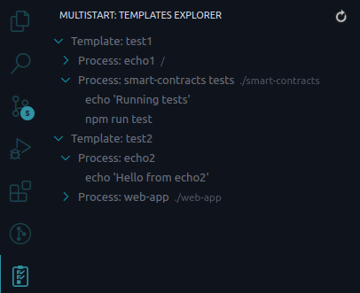

# Multistart

Multistart - light-weight extension to run multiple process in vscode embedded terminal.

## Features

1. Add extensions config in your workspace settings.
2. Find multistart icon in your sidebar
3. Choose desire template and run it :)

## Extension Settings

- `multistart.templates`: Array of objects, that contains declarative instruction for template(name, process). Each object contains set of properties:

  - `name` - human-readable name of template (For example `local-auth-testing`, `web-client`, etc.)
  - `processes` - array of object, contains instructions which will be run in separate vscode terminal
    - `name` - the name of the process, will be shown in the list of terminals
    - `dirPath` - location where `instructions` should be executed, optional parameter
    - `instructions` - list of instructions, which will be executed one by one in separate vscode terminal

  ```json
  "multistart.templates": [
    {
      "name": "test1",
      "processes": [
        {
          "name": "echo1",
          "dirPath": "/",
          "instructions": [["echo", "'Hello from echo1'"]]
        },
        {
          "name": "smart-contracts tests",
          "dirPath": "./smart-contracts",
          "instructions": [
            ["echo", "'Running tests'"],
            ["npm", "run", "test"]
          ]
        }
      ]
    },
    {
      "name": "test2",
      "processes": [
        {
          "name": "echo2",
          "instructions": [["echo", "'Hello from echo2'"]]
        },
        {
          "name": "web-app",
          "dirPath": "./web-app",
          "instructions": [
            ["echo", "'Running web-app'"],
            ["npm", "run", "start"]
          ]
        }
      ]
    }
  ]
  ```

  How it looks like:

  

## Release Notes

Users appreciate release notes as you update your extension.

### 0.0.1

Initial release of multistart vscode extension. Implemented features:

- tasks configuration in workspace settings
- running tasks from command palette
- configuring many instruction to execute in one task(in one terminal)

### 1.0.0

- added templates configuration
- added templates view with control buttons

### 1.0.1

- description fixes
